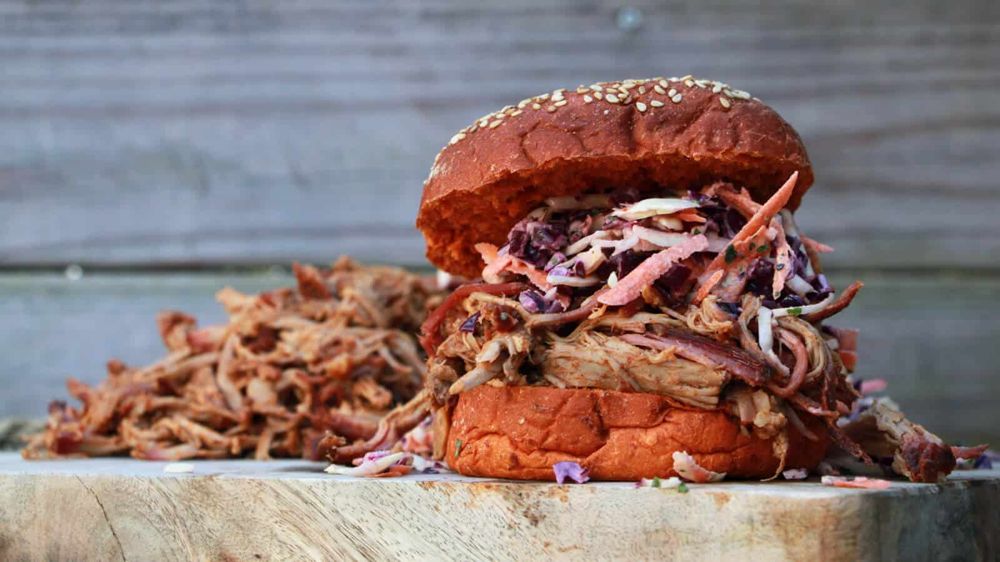

# BBQ Classic: Low & Slow Pulled Pork

Pulled Pork van de BBQ is een regelrechte klassieker en een recept dat je minimaal eens in je BBQ leven moet bereiden. Waarschijnlijk dat het niet bij die ene keer blijft trouwens!

## Receptgegevens

- **Voorbereidingstijd:** 60 min
- **Bereidingstijd:** 600 min
- **Totale tijd:** 720 min
- **Porties:** 6

## Ingrediënten

- 2 kilogram Procureur (Varkensnek)
- 20 eetlepels BBQ Junkie All Purpose BBQ Rub (of kies je favoriet)
- 20 eetlepels BBQ Saus
- 450 milliliter Appelsap
- 150 milliliter Appelazijn
- Coleslaw
- 12 Zachte Witte Bolletjes

## Bereiding

1. Haal de procureur uit de koeling en dep deze droog met wat keukenpapier. Snijd nu alle loshangende stukjes vlees en vet weg. Zitten er dikke stukken vet aan de buitenkant van het vlees? Snijd ook deze dan weg, want je rub kan hier niet intrekken.
2. Neem nu, op 1 eetlepel na, alle BBQ Rub en smeer hier het vlees rondom mee in. Pak daarna het vlees in, in vershoudfolie, en leg het in de koelkast, waar de smaken een nachtje kunnen intrekken.
3. De bereiding van pulled pork kan veel tijd in beslag nemen, voor een stuk procureur van twee kilo duurt dit 7 tot 11 uur, maar bij een groter stuk vlees kan het oplopen tot een bereidingstijd van 16 uur.
4. Begin daarom altijd ruim van te voren, zodat je in ieder geval op tijd klaar bent. Het vlees blijft daarbij nog wel even warm na de bereiding, dus het is helemaal niet erg als je 2 uurtjes eerder klaar bent met de bereiding.
5. Haal het vlees ruim op tijd uit de koeling, maar pak het nog niet uit. Meng in een ruime kom de appelsap en appelazijn. Giet 400 milliliter van dit mengsel in je plantenspuit.
6. Meng daarna de overgebleven eetlepel BBQ rub door de rest van de appelsap en appalazijn. Neem nu de marinade injector en gebruik het mengsel van appelsap, azijn en rub om het vlees mee te injecteren. Doe dit op meerdere plekken in het vlees.
7. Steek nu de BBQ aan en maak deze gereed voor indirect warmte en een temperatuur van ongeveer 120 graden. Is de temperatuur van 120 graden bereikt? Voeg dan wat rookhout toe (ik gebruik vaak chunks appel rookhout) aan de brandende kolen.
8. Haal daarna het vlees uit de vershoudfolie en leg het op de BBQ. Heb je een kernthermometer met een probe aan een draad? Steek de probe dan nu in het vlees. Sluit de BBQ vervolgens met de deksel.
9. De procureur mag nu rustig garen tot een kerntemperatuur van 70 graden, waarbij je het ieder half uur met de plantenspuit besproeit met het mengsel van appelsap en appelazijn.
10. Is de temperatuur van 70 graden bereikt? Bestrijk het vlees dan rondom met de helft van de BBQ saus. Sluit de BBQ weer met de deksel en laat het vlees nog 1,5 uur door garen.
11. Na 1,5 uur mag het vlees tijdelijk van de BBQ. Pak het strak in, in aluminiumfolie en leg het daarna weer terug op de BBQ.
12. Gaar het vlees nu door tot een kerntemperatuur van 88 graden en begin vanaf daar moet voelen of het vlees goed is. Omdat het vlees is ingepakt, doe je dat het gemakkelijkst met een satéprikker. Steek deze af en toe in het vlees, tot het vlees boterzacht aanvoelt. De prikker gaat dan zonder moeite door het vlees heen.
13. Zoals gezegd kan dit al bij een kerntemperatuur van 88 graden het geval zijn, maar kan het ook langer duren. Soms gaar je pulled pork zelfs door tot een kerntemperatuur van 95 of 96 graden.
14. Is het vlees gaar? Haal het dan van de BBQ en leg het in een grote schaal. Pak het vlees nu voorzichtig uit en vang alle sappen op.
15. Pak het vlees nu weer strak in, in aluminiumfolie en laat het nu een uur rusten. Denk niet dat je dat rusten kunt overslaan, want ten eerste is het vlees veel te heet om gelijk te pullen en ten tweede zorgt het rusten er voor dat de sappen zich wat meer over het vlees verdelen en je dus een sappiger resultaat krijgt.
16. Meng ondertussen de opgevangen sappen met een paar eetlepels BBQ Saus en wat van de mix van appelsap en appelazijn.
17. Haal na een uur het vlees weer uit het aluminiumfolie en leg het in een ruime schaal. Trek het vlees nu, eventueel met 2 vorken of vleesklauwen, tot pulled pork en meng het zojuist gemaakte mengsel er doorheen.
18. Je kunt de pulled pork natuurlijk los eten, maar het lekkerst is natuurlijk met op een wit zacht bolletje met wat coleslaw en nog een klein beetje BBQ saus. Eet smakelijk!

Bron: [bbq-junkie.nl](https://bbq-junkie.nl/bbq-recepten/bbq-classic-pulled-pork/)
