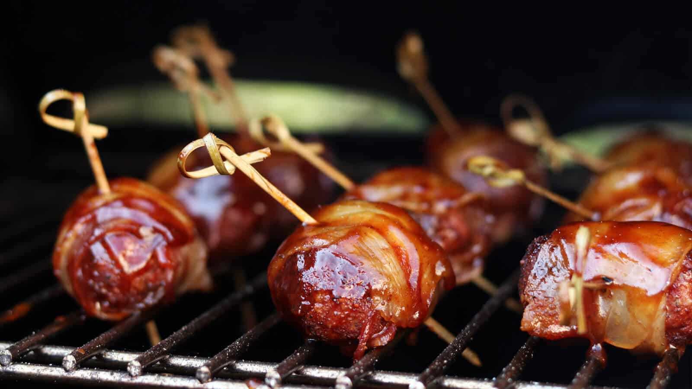

# BBQ Klassieker: MOINK Balls

Ik had al vaak gelezen over MOINK balls, maar ze nog nooit gemaakt. Dat werd dus wel eens tijd. MOINK staat voor de combinatie van rundergehakt en bacon. Moo & Oink dus. De MOINK balls worden indirect gegaard en gerookt, wat zorgt voor een heerlijk mals gehaktballetje, verpakt in bacon, met een heerlijk rokerige smaak. Wat wil je nou nog meer? Niks! Proberen dus!

## Receptgegevens

- **Voorbereidingstijd:** 30 min
- **Bereidingstijd:** 60 min
- **Totale tijd:** 90 min
- **Porties:** 6, 6 personen

## Ingrediënten

- 500 gram Rundergehakt
- 18 plakken Gerookt Ontbijtspek
- 40 gram Geraspte Parmezaanse Kaas
- 2 theelepels Knoflookpoeder
- 1 Ei
- 75 ml Melk
- 50 gram Paneermeel
- 2 eetlepels Italiaanse Kruiden
- 1 eetlepel Versgemalen Zwarte Peper
- 5 eetlepels BBQ Junkie All Purpose BBQ Rub
- 5 eetlepels BBQ Saus

## Bereiding

1. Doe het gehakt in een kom en doe er het ei, de melk, Parmezaanse kaas, knoflookpoeder, Italiaanse kruiden, peper, zout en paneermeel bij. Meng alles goed door elkaar en draai gelijke balletjes van ongeveer 40 gram per stuk van het gehaktmengsel.
2. Strooi nu de BBQ rub op een bord en rol alle gehaktballetjes er doorheen. Kies hiervoor je favoriete kruidenmix of rub uit de winkel, of maak je eigen mengsel van kruiden.
3. Draai vervolgens om ieder gehaktballetje een plak bacon en zet deze vast met een cocktailprikker.
4. Zet de MOINK balls weg in de koelkast en steek de BBQ aan. De balletjes moeten indirect garen, dus we gaan voor een situatie waarbij de helft van het grilrooster zich niet direct boven de kolen bevindt.
5. In een kamado werk je met de zogenaamde platesetter of heat deflector en bij een gas BBQ laat je één van de branders uit. De temperatuur in de BBQ moet rond de 120 graden zijn.
6. Als de BBQ op temperatuur is mag het rookhout worden toegevoegd aan de brandende kolen. Steek een paar chunks tussen de brandende kolen, zodat deze langzaam zullen gaan branden en zo rook afgeven.
7. Leg nu de MOINK balls op het indirecte deel van het grilrooster en sluit de BBQ met de deksel. De balletjes mogen nu 45 minuten garen. Check zo nu en dan de temperatuur van de BBQ, maar open de deksel zo min mogelijk.
8. Na 45 minuten mogen de MOINK Balls even van de BBQ. Smeer ieder balletje rondom in met BBQ saus en leg ze weer terug op het rooster. Weer op het indirecte deel.
9. De balletjes moeten nu nog een kwartiertje garen, waarna ze klaar zijn. Leg de MOINK Balls nu op een bord en serveer ze met de cocktailprikkers er nog in. Dat eet wel zo makkelijk! Eet smakelijk!

Bron: [bbq-junkie.nl](https://bbq-junkie.nl/bbq-recepten/bbq-klassieker-moink-balls/)
