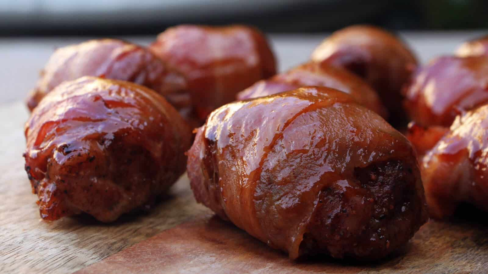

# Chicken Honey Pops van de BBQ

Een BBQ, kippendijen, ontbijtspek en BBQ saus. Veel beter kan het toch niet worden? Deze chicken honey pops zijn heerlijk als voorgerechtje, of als snack bij de borrel. De bereiding is eenvoudig en duurt niet lang en ook de voorbereiding is zo gepiept. En als je dan met zo’n schaal vol lekkere stukjes kippendij in bacon langskomt, dan wil iedereen wel een stukje! Maak er dus genoeg, want ze zijn zo weg!

## Receptgegevens

- **Voorbereidingstijd:** 30 min
- **Bereidingstijd:** 30 min
- **Totale tijd:** 60 min
- **Porties:** 4, 4 personen

## Ingrediënten

- 4 Kippendijen
- 16 plakken Gerookt Ontbijtspek
- 6 eetlepels BBQ Saus
- 6 eetlepels Honing
- 2 eetlepels Gerookt Paprikapoeder
- 1 theelepel Chilipoeder
- 1 theelepel Uienpoeder
- 1 theelepel Knoflookpoeder
- 1 theelepel Zout
- 2 theelepels Versgemalen Zwarte Peper

## Bereiding

1. Neem een kommetje en meng hierin het paprikapoeder, chilipoeder, uienpoeder, knoflookpoeder, zout en de zwarte peper. Neem nu de kippendijen en snijd iedere kippendij in 4 ongeveer gelijke delen.
2. Kruid de stukjes kippendij met het zojuist gemaakte kruidenmengsel en wikkel vervolgens ieder stukje in een plak ontbijtspek. Zet dit even aan de kant.
3. Zet een steelpannetje op laag vuur en doe hier de BBQ saus en de honing in. Warm dit door, tot je de honing goed met de saus kunt vermengen. Haal het pannetje vervolgens van het vuur en laat de saus afkoelen.
4. Steek nu de BBQ aan en ga hierbij voor indirecte hitte en een temperatuur van ongeveer 160 graden.
5. Is de BBQ op temperatuur? Dan kun je nu eventueel je rookhout toevoegen aan de brandende kolen. Ook zonder zijn deze chicken honey pops echter heerlijk, dus rookhout is optioneel in dit recept.
6. Leg de stukjes kip in spek op het rooster van de BBQ en sluit de BBQ met de deksel. Gaar de stukjes kippendij nu 15 minuten en bestrijk ze vervolgens met de honing BBQ saus. Sluit de BBQ deksel weer en gaar de kip nog 5 minuten en bestrijk ze dan nogmaals met de saus.
7. Gaar de kip dan nog eens 10 minuten. De kip zou nu ongeveer gaar moeten zijn. Meet dit met je kernthermometer. Is de kip gaar? Bestrijk de honey pops dan nog 1 keer met BBQ saus en haal ze daarna van de BBQ. Is de kip nog niet gaar? Wacht dan nog heel even tot ze gaar zijn.
8. Serveer de chicken honey pops op een mooie serveerplank of schaal met prikkertjes, zodat je gasten gemakkelijk een stukje kunnen prikken. Eet smakelijk!

Bron: [bbq-junkie.nl](https://bbq-junkie.nl/bbq-recepten/chicken-honey-pops/#recipe)
