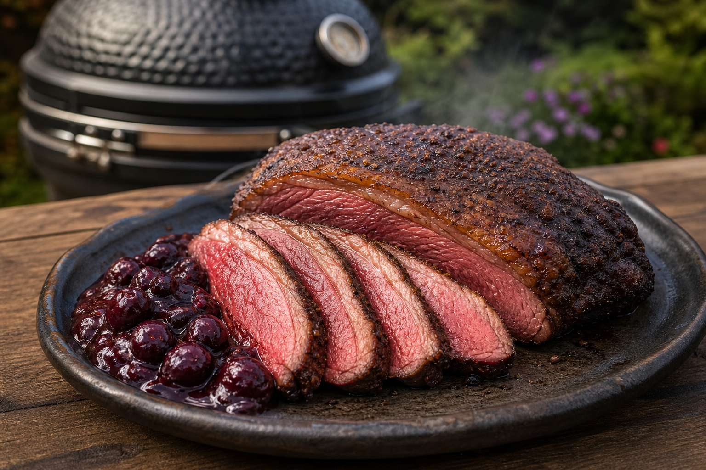

# Picanha met espresso-cacaokorst en kersen-chipotlejus

Bij dit eigen kamadorecept krijgt een hele picanha eerst rustig rook en daarna een korte, hete korst. Espresso en cacao maken het rundvlees niet zoet, maar geven de korst extra diepte. De frisse kersenjus met een klein beetje chipotle houdt het rijke vlees in balans.

## Receptgegevens

- **Voorbereidingstijd:** 25 minuten, plus minimaal 2 uur pekelen
- **Bereidingstijd:** 70 tot 100 minuten
- **Rusttijd:** 10 tot 15 minuten
- **Porties:** 5 tot 6 personen
- **Kamado:** 120 °C indirect, daarna 250 tot 280 °C direct
- **Gaarheid:** 52 tot 54 °C bij het afgrillen voor medium-rare

## Benodigdheden

- Kamado met hitteschild
- Kernthermometer
- Kleine gietijzeren pan of skillet
- Tang
- Scherp vleesmes
- 1 klein blokje appel- of kersenrookhout

## Ingrediënten

### Voor de picanha

- 1 hele picanha van 1,2 tot 1,5 kg, met een gelijkmatige vetkap
- 14 gram fijn zeezout
- 2 theelepels fijngemalen espressokoffie
- 1 1/2 theelepel ongezoet cacaopoeder
- 1 theelepel gerookt paprikapoeder
- 1 theelepel gemalen korianderzaad
- 1 theelepel donkerbruine basterdsuiker
- 1/2 theelepel versgemalen zwarte peper
- 1 eetlepel neutrale olie

### Voor de kersen-chipotlejus

- 300 gram ontpitte kersen, vers of diepvries
- 1 sjalot, fijngesneden
- 150 milliliter runderfond
- 75 milliliter ruby port
- 1 eetlepel balsamicoazijn
- 1 theelepel honing
- 1/2 tot 1 theelepel chipotlevlokken, naar smaak
- 25 gram koude roomboter, in blokjes
- Zout naar smaak

## Voorbereiding

1. Controleer aan welke kant de draad van het vlees loopt en onthoud dit voor het aansnijden. De richting kan bij picanha iets verlopen.
2. Snijd harde vliezen aan de vleeskant weg. Laat de vetkap zitten en snijd deze om de 2 centimeter kruislings in. Snijd alleen door het vet, niet in het vlees.
3. Wrijf de picanha rondom in met het zout. Leg het vlees minimaal 2 uur en maximaal 12 uur onafgedekt in de koelkast. Zo trekt het zout in en droogt de buitenkant voor een betere korst.
4. Meng espresso, cacao, paprikapoeder, koriander, basterdsuiker en zwarte peper. Haal het vlees 30 minuten voor de bereiding uit de koelkast, bestrijk het dun met olie en druk het kruidenmengsel op alle kanten.
5. Meng voor de jus de runderfond, port, balsamicoazijn, honing en chipotlevlokken alvast in een maatbeker. Bewaar de kersen, sjalot en boter apart.

## Kamado voorbereiden

1. Vul de vuurkorf met houtskool en steek de kamado op één plek aan.
2. Plaats het hitteschild voor indirecte hitte en stabiliseer de kamado op 120 °C, gemeten bij de dome.
3. Leg één klein blokje appel- of kersenrookhout tussen de gloeiende kolen. Gebruik niet meer; de espresso en cacao geven al veel diepte.

## Picanha langzaam garen

1. Leg de picanha met de vetkap omhoog op het rooster en steek de thermometer vanaf de zijkant in het dikste deel van het vlees.
2. Sluit de deksel en gaar het vlees tot een kerntemperatuur van 45 tot 47 °C. Reken afhankelijk van de dikte op 50 tot 75 minuten, maar volg altijd de kerntemperatuur.
3. Haal de picanha van de kamado en leg haar losjes onder aluminiumfolie. Verwijder het hitteschild, open de luchttoevoer en breng de kamado naar 250 tot 280 °C voor directe hitte.

## Afgrillen

1. Leg de picanha eerst 60 tot 90 seconden met de vetkap omlaag op het hete rooster. Blijf erbij: smeltend vet kan kort opvlammen. Verplaats het vlees direct als de vlammen aanhouden.
2. Gril de vleeskant en beide zijkanten elk 45 tot 60 seconden, tot er een donkerbruine korst ontstaat.
3. Haal het vlees van het rooster zodra de kern 52 tot 54 °C is. Laat het 10 tot 15 minuten onafgedekt rusten; de temperatuur loopt nog enkele graden op.

## Kersen-chipotlejus

1. Zet tijdens de rusttijd de gietijzeren pan op het hete rooster. Voeg 5 gram van de boter en de sjalot toe en bak ongeveer 1 minuut.
2. Voeg de kersen toe en bak ze 2 minuten, tot ze warm worden en enkele exemplaren openbarsten.
3. Schenk voorzichtig het mengsel van fond, port, balsamico, honing en chipotle in de pan. Laat de jus 5 tot 7 minuten stevig inkoken tot hij licht stroperig is. Sluit de kamado niet volledig; de jus moet kunnen verdampen.
4. Haal de pan van het vuur. Roer de resterende koude boter er blokje voor blokje door en breng zo nodig op smaak met zout. Laat de jus daarna niet meer koken.

## Serveren

Snijd de picanha haaks op de draad in plakken van ongeveer 1 centimeter. Leg het vlees op een warme schaal en schep een deel van de kersen-chipotlejus ernaast, zodat de korst krokant blijft. Serveer de rest van de jus apart.

Geroosterde zoete aardappel, gegrilde groene asperges of een bittere salade met rucola passen er goed bij.

## Tips

- Gebruik echt espressopoeder of zeer fijn gemalen koffie. Grove koffie blijft hard en geeft een zanderige korst.
- De cacao hoort bitter en ongezoet te zijn. Chocolademelkpoeder maakt de rub te zoet en verbrandt snel.
- Geen port in huis? Vervang deze door 50 milliliter ongezoet kersensap en voeg 25 milliliter extra runderfond toe.
- Liever medium? Haal de picanha na het afgrillen bij 57 tot 59 °C van het rooster.
- Snijd alleen af wat je direct serveert. Een overgebleven stuk blijft sappiger dan losse plakken.
