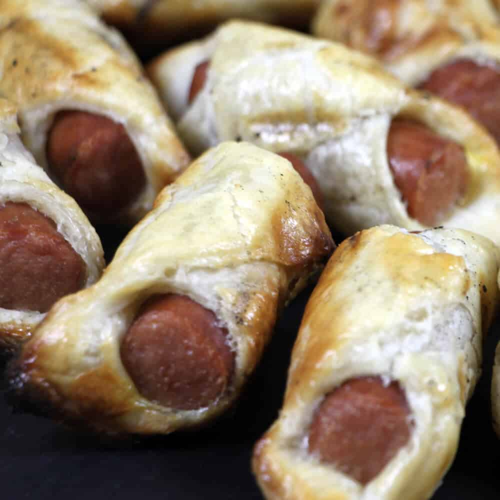

# Pigs in a Blanket

Een recept dat we allemaal kennen, maar dan van de BBQ: knakworstjes in bladerdeeg. Pigs in a Blanket zijn ideaal als BBQ gerecht voor kinderen!

## Ingrediënten

- 1 blik Knakworsten
- 5 plakjes Diepvries Bladerdeeg
- 1 Ei

## Overige Benodigdheden

- BBQ met Deksel
- Bakkwast
- Pizzasteen (optioneel)

## Bereiding

1. Steek de BBQ aan en ga hierbij voor indirecte hitte en een temperatuur van ongeveer 180 graden. Heb je een pizzasteen? Dan kun je deze gebruiken. Leg hem dan op je rooster, zodat deze ook voorverwarmt. Je kunt deze knakworsten in bladerdeeg ook gewoon op je grilrooster bereiden, dus een pizzasteen is geen vereiste.
2. Haal nu het bladerdeeg uit de vriezer en laat dit ontdooien. Giet ondertussen het vocht van de knakworstjes weg en snijd alle knakworsten doormidden.
3. Als het bladerdeeg een beetje ontdooid is, kunnen de plakken in vieren worden gesneden. Vouw daarna een plakje om iedere halve knakworst en druk de randen goed aan. Hier kun je natuurlijk je creativiteit op loslaten door verschillende vormen te maken en het is ook een leuk klusje voor de kinderen.
4. Zijn alle knakworsten ingepakt in bladerdeeg? Klopt dan je ei los en bestrijk met de bakkwast ieder bladerdeeghapje met wat ei.
5. Ondertussen is de BBQ wel op temperatuur en is het tijd om de Pigs in a Blanket te bakken. Leg ze hiervoor op het rooster of de pizzasteen en sluit de BBQ met de deksel. Bak de hapjes in 10 tot 15 minuten goudbruin en gaar. Let op: bak je de bladerdeeghapjes op het rooster? Dan is het verstandig ze halverwege om te draaien. Mijn ervaring is dat ze anders te donker worden aan de onderkant.
6. Zijn je Pigs in a Blanket klaar? Leg ze dan op een bord of plank en serveer ze direct. Eet smakelijk!

Bron: [bbq-junkie.nl](https://bbq-junkie.nl/bbq-recepten/pigs-a-blanket/)
