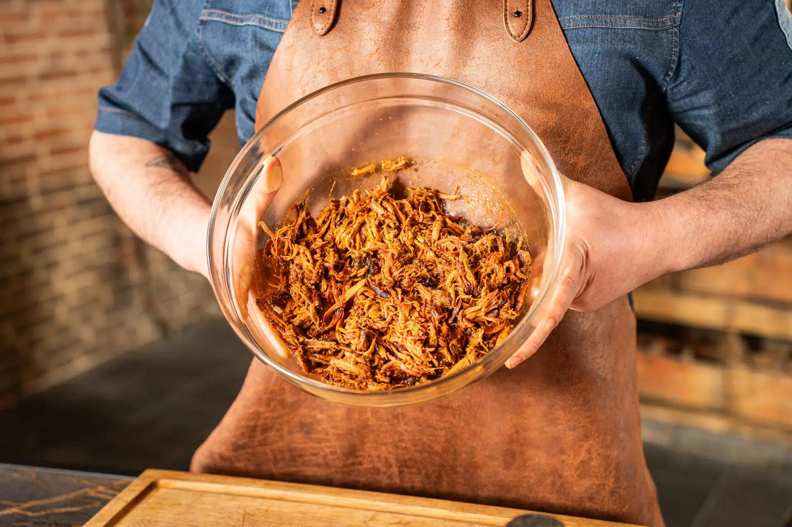

# Pulled pork low & slow

Deze BBQ-klassieker wordt langzaam gerookt en met boter en BBQ-saus verder gegaard. Serveer de pulled pork op een broodje, bij loaded fries of in een gerecht naar keuze.

## Receptgegevens

- **Niveau:** Makkelijk
- **Hoeveelheid:** 5 personen
- **Gang:** Hoofdgerecht
- **Tijd:** 8 uur

## Ingrediënten

- Varkensnek, 1 kg
- Pigasus MeatCoLab
- Originals heritage BBQ-saus
- Roomboter, 100 gram

## Benodigdheden

- Lekbak disposable
- Marinadespray
- Meat claws
- Snijplank
- Thermapen one
- Eiken chunks
- BBQ & grill folie

## Voorbereiding pulled pork

1. Steek de BBQ aan en richt hem volledig indirect in op 120 graden.
2. Wrijf de varkensnek royaal in met Pigasus rub en laat dit enkele minuten intrekken. Doe dit bij voldoende tijd een dag van tevoren.

## Pulled pork op de BBQ

1. Plaats de varkensnek op de kamado met een met water gevulde lekbak eronder en enkele eiken rookchunks tussen de gloeiende kolen.
2. Rook het vlees ongeveer 90 minuten en spray het iedere 30 minuten met water voor een goede bark. Ga door tot een kerntemperatuur van 65 graden.
3. Pak het vlees in met BBQ & grill folie en voeg enkele klontjes roomboter en een scheut BBQ-saus toe.
4. Gaar verder tot een kerntemperatuur van 95 graden en laat het vlees daarna 60 minuten rusten in een thermobox.

## Serveren

1. Haal het vlees uit de folie en bewaar de ontstane jus.
2. Trek het vlees met meat claws uit elkaar en verwijder eventuele vetknobbels.
3. Meng de jus en wat extra BBQ-saus door het vlees. Serveer als broodje pulled pork, bij loaded fries of naar eigen inzicht.

> Tip: Maak wat extra pulled pork; dit kan worden ingevroren om later te eten.

Bron: [BBQ Experience Center](https://www.bbqexperiencecenter.be/nl/recept/pulled-pork-low-slow/)
