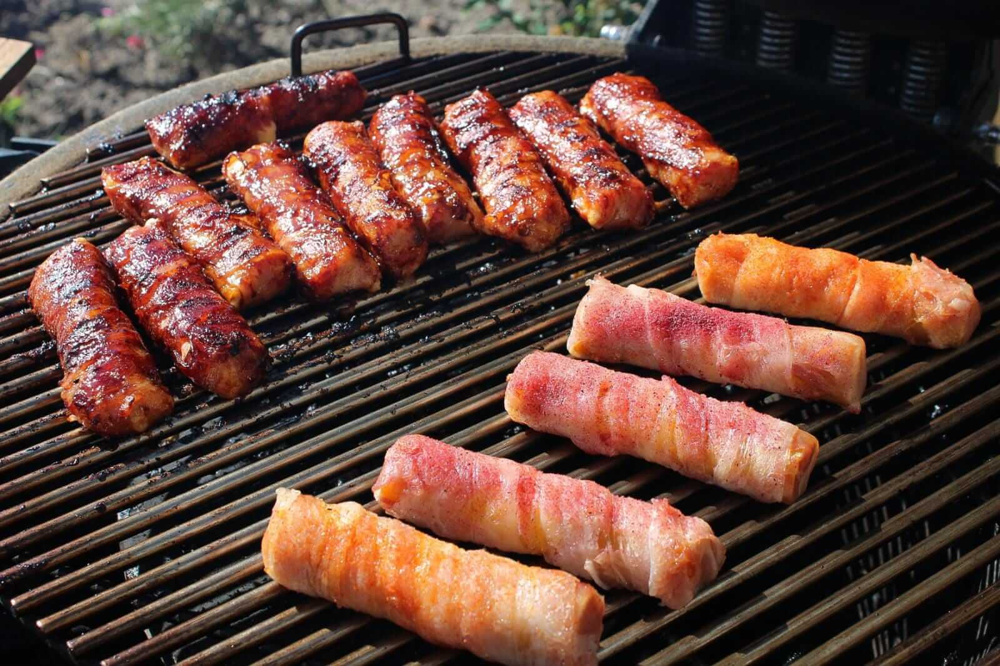

# Shotgun Shells/ Gevulde Canneloni BBQ recept

De perfecte snack voor op een verjaardag of feestje. Het recept is vrij makkelijk te bereiden en je hebt niet veel tijd nodig. Wil je dus eens wat anders, dan is het Shotgun shells bbq recept vast iets voor jou!

## Receptgegevens

- **Voorbereidingstijd:** 60 min
- **Bereidingstijd:** 60 min
- **Totale tijd:** 120 min
- **Porties:** 6, 6 personen

## Ingrediënten

- 15 stuks cannelloni
- 2 pakjes lange stroken ontbijtspek
- 500 gram rundergehakt
- 1 pakje mini buffalo mozzarella galbani
- 100 gram geraspte jonge kaas
- 1 stuk ei
- 3 eetlepels dry rub all use
- 200 ml smokey BBQ saus

## Bereiding

1. Meng het gehakt met de geraspte jonge kaas, het eitje en de BBQ rub/kruiden. Het mengsel komt er uit te zien als onderstaande foto.
2. Vul de cannelloni’s eerst met het mozzarella balletje. Plaats deze in het midden van de pasta. Hierna vul je weers kanten af met het gehakt mengsel. Kijk hierbij wel uit dat je de pasta niet kapot drukt en doe dit dus voorzichtig.
3. Nadat je de Cannelloni’s hebt gevuld omwikkel je deze goed met spek, zorg dat weers kanten en de gehele ronding zijn omwikkelt. Het is de bedoeling dat het geheel is afgedicht zodat er geen tot weinig vocht kan ontsnappen en de pasta goed gegaard kan worden in het spek omhulsel. Kruid de shotgun shells hierna nogmaals licht met wat BBQ rub. TIP: Maak de shotgun shells de dag van tevoren en zet ze een nachtje in de koelkast. Zo kan de pasta alvast mooi zacht worden van het vocht uit het gehakt en de mozzarella. Dan krijg je net een mooier resultaat.
4. Zorg dat je de BBQ klaarmaakt voor indirecte hitte rond de 120 graden. De BBQ tijd van dit gerecht ligt rond een uur. Laat de shotgun shells eerst 10-15 minuten garen zodat de spek iets krokant kan worden. Hierna begin je met het insmeren van de shotgun shells met glaze/saus. Dit herhaal je 2 tot 3 keer gedurende het gaar proces en pas je royaal toe.
5. Nadat je de Shotgun shells van de BBQ afhaalt serveer je ze bijvoorbeeld zoals onderstaand. Het officiële recept bevat ook nog een klein plakje cheddar kaas gesmolten over het uiteinde van de shotgun shell. Wij hebben er voor gekozen om dit niet te doen aangezien we ook al jonge kaas en mozzarella gebruiken in de vulling.

Bron: [turndontburn.nl](https://turndontburn.nl/bbq-recepten/shotgun-shells-gevulde-cannelonis-bbq-recept/)
