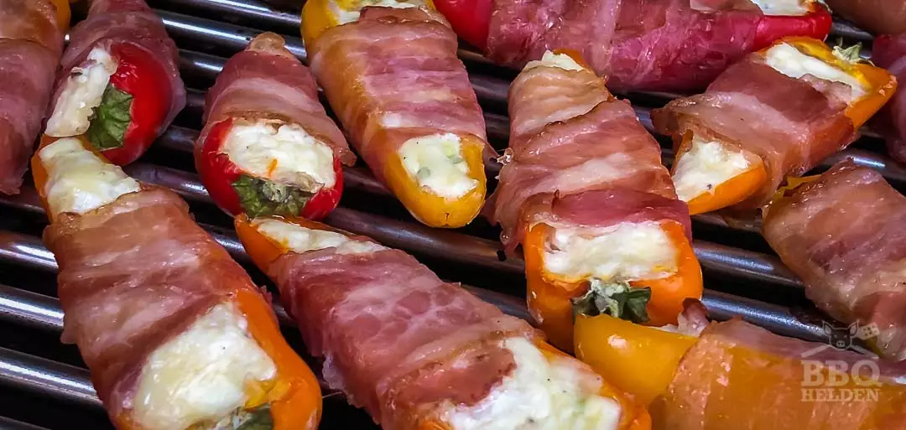

# Snoeppaprika poppers voor een kinderfeestje

Het is niet voor niets dat de jalapeño popper altijd als eerste op gaat op een barbecuefeestje. Het is bijna de perfecte snack die je in 2 happen naar binnen hebt. 1 hap als je echt een grote mond hebt. Al is een jalapeño nog niet heel heet. Toch kunnen sommige gasten die hitte niet waarderen. Daarom hebben we de snoeppaprika popper verzonnen.

## Ingrediënten

- 12 snoeppaprika’s
- 300 gram roomkaas
- 1 theelepel knoflookgranulaat
- 1 theelepel uienpoeder
- 2 eetlepels fijngesneden lente-ui
- 100 gram geraspte belegen kaas
- ontbijtspek

## Bereiding

1. We gaan de snoep paprika poppers indirect bereiden op een temperatuur van ongeveer 200 graden Celsius.
2. Snij de snoep paprika’s door het midden en schraap met een theelepel de zaden en zaadlijsten uit de paprika’s.
3. Mix de roomkaas met de knoflookgranulaat, uienpoeder, de lente-ui en de geraspte belegen kaas.
4. Vul de halve paprika’s en draai er een plak ontbijtspek omheen
5. Steek een tandenstoker door het uiteinde van de spek in de paprika zodat het spek op zijn plek blijft.
6. Plaats de snoep paprika poppers op het rooster zo ver mogelijk weg van directe hitte en sluit het deksel.
7. Na 20 tot 30 minuten zijn de poppers klaar als de paprika’s zacht zijn en de spek goudbruin
8. Laat ze 5 tot 10 minuten afkoelen voordat je ze serveert.

Bron: [bbq-helden.nl](https://bbq-helden.nl/recepten/snoeppaprika-poppers-kinderfeestje/)
