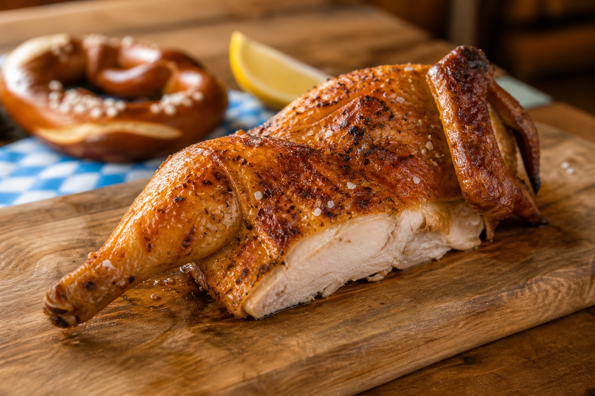

# Wiesn-Hendl van de kamado

Dit is een kamadoversie van het klassieke halve braadhaantje van het Oktoberfest in München: sappig vlees, een dunne krokante huid en een eenvoudige smaak van boter, peterselie, citroen, paprika, zout en peper. Geen zoete BBQ-rub en geen rookhout; een Wiesn-Hendl hoort naar gebraden kip te smaken, niet naar gerookte barbecue. Je kunt kiezen tussen bereiding op een draaispit of op het gewone grillrooster. Het draaispit benadert de grote rotisseriegrills op de Wiesn het best, maar indirect garen zonder spit geeft ook een uitstekend resultaat.

## Receptgegevens

- **Voorbereidingstijd:** 25 minuten
- **Droogtijd (optioneel):** 8 tot 24 uur
- **Bereidingstijd:** 70 tot 95 minuten
- **Rusttijd:** 10 minuten
- **Porties:** 2 personen, ieder een halve kip
- **Kamado:** eerst 160 °C, daarna 185 °C
- **Gaarheid:** minimaal 75 °C kerntemperatuur

## Benodigdheden

- Kamado
- Kernthermometer
- Slagerstouw
- Kleine lekbak
- Kwast

Kies daarnaast de benodigdheden voor één van de twee methoden:

- **Met draaispit:** een passend draaispit
- **Zonder draaispit:** een hitteschild en het gewone grillrooster; een kiphouder is optioneel

## Ingrediënten

- 1 hele braadkip van 1,2 tot 1,4 kg
- 40 gram ongezouten roomboter, op kamertemperatuur
- 1 flinke bos platte peterselie
- 1 biologische citroen
- 1 eetlepel zonnebloemolie
- 2 theelepels fijn zout
- 1/2 theelepel versgemalen zwarte peper
- 1/2 theelepel scherp paprikapoeder (Rosenpaprika)

### Voor het zoutwater

- 1 eetlepel warm water
- 1 theelepel fijn zout

## Voorbereiding

1. Verwijder eventuele ingewanden en overtollig vet uit de kip. Was de kip niet, maar dep haar van binnen en buiten zeer goed droog met keukenpapier. Verwijder eventueel het staartstuk.
2. Voor een extra krokante huid leg je de kip, bij voorkeur 8 tot 24 uur van tevoren, onafgedekt op een rooster in de koelkast. Haal haar ongeveer 30 minuten voor het grillen uit de koelkast.
3. Rasp een halve theelepel van de gele citroenschil en pers een halve citroen uit. Snijd de andere helft in parten om erbij te serveren.
4. Meng de olie met 1 eetlepel citroensap, de citroenrasp, 1 1/2 theelepel zout, de peper en het paprikapoeder.
5. Maak vanaf de halszijde voorzichtig de huid boven beide borsthelften los. Verdeel 30 gram boter onder de huid zonder deze te scheuren. Wrijf de kip van binnen en buiten dun in met het kruidenmengsel.
6. Kneus de peterselie licht met je handen en stop de hele bos samen met de resterende 10 gram boter losjes in de buikholte. Vul de kip niet stevig; warme lucht moet kunnen circuleren.
7. Bind de poten bij elkaar en zet de vleugelpunten met slagerstouw tegen het lichaam vast. Dit voorkomt dat uitstekende delen te donker worden. Kies daarna methode A of methode B.

## Methode A: met draaispit

### Kamado voorbereiden

1. Vul de vuurkorf met houtskool en steek de kamado op één plek aan. Gebruik geen rookhout.
2. Schuif de gloeiende kolen zo veel mogelijk naar de achterzijde van de kamado. Zo komt de stralingswarmte vooral van opzij, zoals bij een traditionele kiprotisserie, en valt er minder vet rechtstreeks in het vuur.
3. Plaats geen hitteschild tussen het vuur en de kip. Zet wel een kleine lekbak onder de kip, zonder de luchtstroom af te sluiten.
4. Monteer het draaispit en stabiliseer de kamado op 160 °C, gemeten bij de dome.

### Bereiding

1. Rijg de kip precies door het midden aan het spit en zet de vorken stevig vast. Draai het spit met de hand rond om te controleren of de kip goed in balans is.
2. Plaats het spit, start de motor en sluit de deksel. Laat de kip 35 minuten draaien op 160 °C. Houd de deksel zo veel mogelijk gesloten; door het draaien bedruipt de kip zichzelf.
3. Meng ondertussen het warme water met 1 theelepel zout. Het hoeft geen volledig heldere pekel te worden.
4. Bestrijk de kip na 35 minuten rondom heel dun met het zoutwater. Verhoog de kamadotemperatuur naar 185 °C en laat de kip nog 30 tot 50 minuten draaien.
5. Controleer vanaf 65 minuten de kerntemperatuur in het dikste deel van de borst en de dij, zonder het bot te raken. De kip is klaar wanneer beide minimaal 75 °C zijn en de huid diep goudbruin en krokant is.
6. Is de kip gaar maar nog niet krokant genoeg, open dan de luchttoevoer kort en laat haar maximaal 5 minuten op 200 tot 210 °C draaien. Blijf erbij: boter en paprikapoeder kleuren snel.
7. Haal de kip van het spit en laat haar 10 minuten onafgedekt rusten. Losjes afdekken maakt de huid zacht.
8. Verwijder de peterselie. Snijd de kip in de lengte door het borstbeen en langs de ruggengraat in twee gelijke helften.

## Methode B: zonder draaispit

### Kamado voorbereiden

1. Vul de vuurkorf met houtskool en steek de kamado op één plek aan. Gebruik geen rookhout.
2. Plaats het hitteschild, of beide halve hitteschilden, voor volledig indirecte hitte. Zet een kleine lekbak op het hitteschild of op het accessoirerek; laat rondom voldoende ruimte voor de luchtstroom.
3. Plaats het gewone grillrooster boven de lekbak en stabiliseer de kamado op 160 °C, gemeten bij de dome.

### Bereiding

1. Leg de kip met de borst omhoog midden op het grillrooster. Richt de poten naar de achterzijde van de kamado, waar het doorgaans iets warmer is. Gebruik je een kiphouder, zet de kip dan rechtop boven de lekbak.
2. Sluit de deksel en gaar de kip 35 minuten op 160 °C. Open de kamado in deze periode niet.
3. Meng ondertussen het warme water met 1 theelepel zout. Het hoeft geen volledig heldere pekel te worden.
4. Draai na 35 minuten de kip horizontaal een halve slag voor een gelijkmatige bruining. Keer haar niet om: de borst blijft boven. Bestrijk de huid rondom heel dun met het zoutwater.
5. Verhoog de kamadotemperatuur naar 185 °C en gaar de kip nog 35 tot 55 minuten met de borst omhoog.
6. Controleer vanaf 70 minuten de kerntemperatuur in het dikste deel van de borst en de dij, zonder het bot te raken. De kip is klaar wanneer beide minimaal 75 °C zijn en de huid diep goudbruin en krokant is.
7. Is de kip gaar maar nog niet krokant genoeg, verhoog dan de temperatuur naar 200 tot 210 °C. Laat de huid maximaal 5 minuten kleuren en blijf erbij om verbranden te voorkomen.
8. Haal de kip van de kamado en laat haar 10 minuten onafgedekt rusten. Losjes afdekken maakt de huid zacht.
9. Verwijder de peterselie. Snijd de kip in de lengte door het borstbeen en langs de ruggengraat in twee gelijke helften.

## Serveren

Serveer iedere gast een halve kip met een part citroen en een verse Brezn. Een Beierse aardappelsalade past erbij, maar op de Wiesn wordt het Hendl ook gewoon zonder saus en met de handen gegeten.

## Tips voor een authentiek resultaat

- Kies een niet te grote kip. Een exemplaar van ongeveer 1,3 kg gaart gelijkmatiger en lijkt meer op het formaat dat voor een Wiesn-Hendl wordt gebruikt.
- Laat knoflook, tijm, rozemarijn, suiker en BBQ-saus achterwege. Peterselie, boter, citroen, paprika, zout en peper bepalen het klassieke profiel.
- Gebruik schoon brandende houtskool zonder rookhout. De kamado mag warmte en een heel licht vuuraroma geven, maar geen uitgesproken rooksmaak.
- Het dunne laagje zoutwater aan het einde helpt de huid droog, hartig en krokant te worden. Breng het spaarzaam aan.

Bronnen: [München Tourismus – Wiesnhendl-recept](https://www.muenchen.travel/artikel/essen-trinken/rezept-wiesnhendl) en [Voedingscentrum – veilige kerntemperatuur voor kip](https://www.voedingscentrum.nl/nl/gezonde-recepten/kookhulp/braden-hoe-braad-ik-.aspx).
